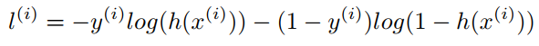
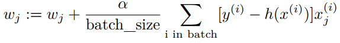

<center>
<h1>
In The Name Of ALLAH
</h1>
<h2>
Advanced Programming - Homework 1
</h2>
<h2>
Dr.Amir Jahanshahi
</h2>
<h3>
Deadline: Friday, 11 Mehr - 23:00
</center>


# Introduction
In this exciting homework you are going to predict the probability that an **AP** student passes the course based on the previous performance of AP students. After many hours of analysis, we founded that there are 6 main features determining whether an AP student would pass the course or not. These 6 features are:

1.   Attention in the class (Between 0 and 1)
2.   Attention in the TA class (Between 0 and 1)
3.   Hours of coding and practicing in the week
4.   Hours of studing and reading books in the week
5.   Previous background (Between 0 and 1)
6.   Talent (Between 0 and 1)

So, you are given a dataset of 234 students. For each student we have these 6 features and the fact that he/she has passed the course :) or not :(. Let's begin.

# Importing Data
Data of previous students is gathered in **AP-Data.csv**. First of all, implement **getData** function such that it gets the path to the data file and returns a vector consisting of vectors of type double for data given. Each member of this returned vector, is itself a vector consisting of the features of a student. In the AP-Data file, each row is the information of a student. The first 6 numbers of each row are the 6 features told above and the last number is 1 if the student has passed the course or 0 if not.

For example, one of the rows of this file is

0.9, 0.9, 10, 3, 0.4, 0.6, 1

So this row is about a student who had a good attention in classes and coded about 10 hours a week (not counting his time on homeworks!) but had little time reading and so on. Finally he passed the course! 

In your returning vector, each element is itself a vector representing each student. If the ```add_bias``` argument is **true**, you must put a **1** in the first place of each students vector. So in this case, each student's vector must contain a **1** and after that the 6 parameters and the passing status. So, if ```add_bias``` is **true**, your vector for the above student should be like the following.

1, 0.9, 0.9, 10, 3, 0.4, 0.6, 1

Prototype for your function is
``` c++
std::vector<std::vector<double>> getData(const char* filename, bool add_bias= false);
```

# Displaying Data
Time for displaying imported data in a beautiful way! Implement **displayDataset** function to do this. 

``` c++
void displayDataset(std::vector <std::vector <double >>, bool has_bias=false);
```
Your output should look like this...


# Predictor Function
We assume that each student's passing probability is a non-linear function of his/her features. First of all, we make a linear combination of the i-th student's features, as the following.


This number can be anything from -infinity to +infinity. So we pass it through a nonlinear function called **sigmoid** to map it between 0 and 1 (So that it can represent a probability!). Just like below.


Isn't it beautiful? So implement the **h** function to predict a students probability of passing, based on his/her features just like what we discussed above.

```
double h(std::vector<double> features, std::vector<double> w);
```

# Cost Function
We must measure how good are our weights (w vector) in case of predicting passing status of all the students. So we define the following function, called **loss function** for the i-th student as



Note that the closer our probability to the truth, the lower this function. For example, if the student hasn't passed the course and we predict the probability of passing for he/she as 0.1, then the loss function for him or her would be


But, if we had predicted 0.9 as the probability, the loss function would be


To better judge our predictions, it's not enough to see how well we are doing on just one student. We must see how well we are predicting, regarding *all* or *some* of the students. Now we define the following function, called **cost function** as


Note that this function is just a simple average of loss functions of a bunch of students.
So implement the **J** function.
```c++
double J(std::vector<std::vector<double>> data, std::vector<size_t> indices, std::vector<double> w);
```

# Finding Appropriate Weights
It suffices now to find the weights that minimize the cost function so that we can hope to have a good estimator! As you now, to minimize a function, we can start from an arbitrary point and in each step, go in the opposite direction of the gradient at that point. The final formula to update the weights at each iteration is


(The theoretical stuff of how to derive this formula would be discussed in the last part of TA class for those who love math).
First of all, we have the **fitOneEpoch** function. This function's prototype is
```c++
std::vector<double> fitOneEpoch(std::vector<std::vector<double>> data, std::vector<double> w0, double lr= 0.01, size_t batch_size= 8);
```
It divides data into batches of *batch_size* length. Although it's not theoretically correct in general, but for the sake of simplicity, divide data in sequential order. For example, if *batch_size* is 8, you take the first 8 students into the first batch, the second 8 students into the second batch and so on. Then you do the following update for each batch. 



Whenever you do the update for all batches, we say that **you have trained one epoch**. This function finally returns the new (updated) weights.

Now implement the **fit** function to above job, several epochs. 
```c++
std::vector<double> fit(std::vector<std::vector<double>> data, std::vector<double> w0, double lr= 0.01, size_t epochs=10, size_t batch_size= 8, bool verbose=false);
```
In the case of verbose being **true**, you must display the cost function in each epoch in an appropriate way like the below.


If verbose if **false**, just print the the first and the final cost functions.

# Prediction
Almost done! Just implement the ```predict``` function with the following prototype

```c++
std::vector<double> predict(std::vector<std::vector<double>> data, std::vector<double> w, bool verbose=false);
```
It gets a dataset and some weights. It then, calculates the probability of passing for each student in the dataset and return the results as a vector. If verbose is **true**, it shows the real results and predictions for each student in a beautiful table.

The following block should run without any errors.

```c++
std::vector<std::vector<double>> data{getData("AP-Data.csv")};
std::vector<double> w (7, 0);
w = fit(data, w, 0.01, 5000, 8, false);
std::vector<double> outputs{predict(data, w)};
```


# main File
You must not alter the **main.cpp** file at all. Just write all your codes in the **aphw1.cpp** and **aphw1.h**. Good luck!


